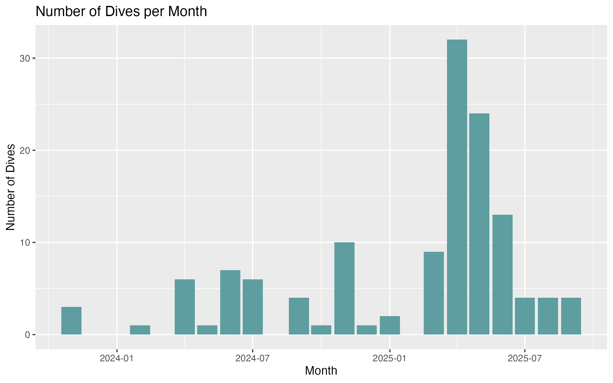
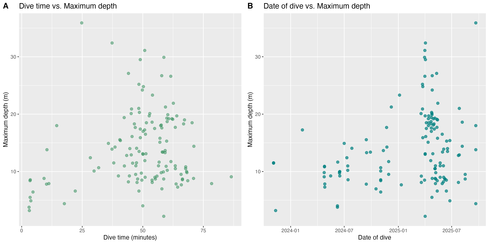

## Introduction

To better understand my recreational dive history and trends, I have compiled my
dive data to display trends. Additionally I have included a visual representation
of the areas with the highest density of dives.

Using R Studio, I have worked to better process and visualize data, and learn 
how to effectively represent results in a palatable manner.

## Objective

Manipulated dive computer data to calculating the total bottom time,
average bottom time, and number of dives, with the goal of better
understanding relationships between dive time vs depth, and dive date vs
depth. Additionally interested in visual representation of regular dive
areas.

## Data Sources

My data was sourced from my personal dive computer, which I exported and used 
as the single CSV dataset for this project. The variables include numeric values 
(dive number, dive time, and max depth), character variables (start and end times),
and date variables (date).

## Data Processing

To transform my raw data into final results, I first tidied my dive log by 
converting dates and times, standardizing depth measurements, and cleaning 
column names. I then filtered the dataset to remove any dives <3 minutes to
more accurately represent logged SCUBA dives and related dive time. With the 
resulting tidy data I visualized relationships between dives per month, dive 
time and depth, and dive date and depth. Finally, I displayed my most concentrated
locations for diving over the past 2 years.

## Comparative Findings {.scrollable}

The answer to your questions




## Geographical Representation 

Regular dives were performed primarily in Monterey, CA, USA and the Gili Islands off of Lombok, Indonesia.

```{r}

library(ggplot2)      
library(ggspatial)     
library(rnaturalearth) 
library(sf)          
library(mapview)       
library(terra)        
library(tidyterra) 
library(here)  
library(tidyverse)

depth <- rast(here("data/raw/depth_raster.tif"))

world <- ne_countries(scale = "small", returnclass = "sf")

plot(depth)
plot(world, add = TRUE)

monterey_box <- st_as_sfc(st_bbox(c(xmin = -122.1, xmax = -121.7,
                                 ymin = 36.5, ymax = 36.7),
                               crs = 4326)) |>
  st_as_sf(dive_location = "Monterey")

gili_box <- st_as_sfc(st_bbox(c(xmin = 116.00, xmax = 116.15,
                                 ymin = -8.40, ymax = -8.30),
                               crs = 4326)) |>
  st_as_sf(dive_location = "Gili Islands")

boxes <-bind_rows (monterey_box, gili_box)

regular_dive_areas <- ggplot() + geom_spatraster(data = depth) +
  scale_fill_viridis_c(option = "mako", name = "Ocean Depth (m)") +
  geom_sf(data = world, fill = "grey", color = "grey") +
  geom_sf(data = st_centroid(boxes), mapping = aes(color = dive_location),
          size = 4) +
  scale_color_discrete(name = "Dive Areas") +
  ggtitle("Regular Dive Areas") +
  theme(plot.title = element_text(face = "bold")) +
  annotation_scale(location = "bl") +
  annotation_north_arrow(location = "br") +
    labs(caption = "P.S. Dive Computer Data")
```

```{r}
tidy_divecomp_data <- read_rds(here("data/processed/Tidy_Dive_Computer_Data.rds"))

avg_dives_per_month <- tidy_divecomp_data %>%
  mutate(month = floor_date(date, "month")) %>%   
  count(month) %>%                                
  summarise(avg_dives = mean(n)) %>%
  pull(avg_dives)

```

On average, I dive `r scales::number(avg_dives_per_month, accuracy = 0.1)` times per month.

## References

 - Hernangómez D (2023). “Using the tidyverse with terra objects: the tidyterra package.” Journal of Open Source Software, 8(91), 5751. ISSN 2475-9066, doi:10.21105/joss.05751, https://doi.org/10.21105/joss.05751.


 - Massicotte P, South A (2025). “rnaturalearth: World Map Data from Natural Earth.” R package version 1.1.0, doi:10.32614/CRAN.package.rnaturalearth, https://doi.org/10.32614/CRAN.package.rnaturalearth
